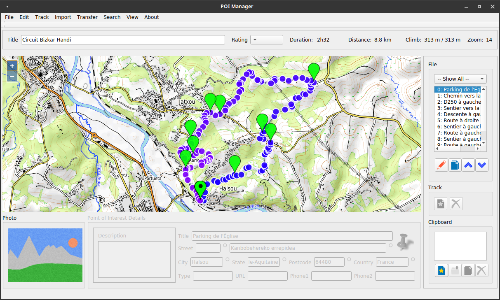

# POI - Points of Interest and Track management.

# Background and Overview

This program is capable of managing points of interest files, which are saved in both .gpx and .ov2 formats for Garmin and TomTom GPSs.
In addition, it is capable of managing .gpx tracks (with waypoints).
The program can import and export tracks from/to a filesystem mounted Garmin GPS, such as the E-Trex series.  Exporting to a TomTom GPS launches and uses a third party web browser.

When walking tracks are saved, the first waypoint on the track is also saved to a tracks.gpx, and tracks.ov2 file, which is particularly useful if the first point on a walk is accessed by car.

This program is provided free of charge, and no warranty or guarantees are offered.

# Manual
The latest manual can be found here: 
https://github.com/trumpton/POI/blob/master/manual/POI_Manager_Manual_v0.1.pdf

# Configuration

The program has certain map tile servers built-in, but these can be overridden using the POI.ini file (an example of which exists in the src directory).

In addition to the map tile server URLs, the configuration recognises three different keywords, which are used to identify built-in features:

OSM - this is used to specify the base map, and the Nomaitm Open Streetmaps geocoding.
Here - this is used to specify the Here geocoding (application id and code required in the keys section)
Bing - this is used to specify the Bing aerial maps (key required in the keys section)

# Building - Preparation

Ensure that all of the QT modules and supporting apps are installed, including:

   qtcreator, qt5, qt5-default
  
   qtwebengine5-dev, libqt5webenginewidgets5, qtwebenginewidgets-dev, 
   qtdeclarative5-dev

   g++, cmake

In order to create an AppImage (optional), you will also need: linuxdeployqt and appimagetool, available from:

  https://github.com/probonopd/linuxdeployqt/releases
  https://github.com/AppImage/AppImageKit/releases/tag/continuous

These tools should be installed into your path.

# Building - Configuration and Build

Either make with qtcreator, or manually create a build folder at the same level as the source folder and make as follows:

  mkdir build
  cd build
  /usr/lib/qt5/bin/qmake -o Makefile ../src/POI.pro -spec linux-g++ CONFIG+=debug CONFIG+=qml_debug
  make

The configuration is not loaded from the POI.ini file, which must be manually edited if keys are to be added.
The file is automatically created (copied from the exe folder) when the configuration directory is selected from
the configuration menu.

# Building - Creating a Release

If you wish to create an AppImage, you can also do the following

  cd ../release
  cp ../build/POI .
  linuxdeployqt POI

# Debugging

Add the following line to the command line in order to use a chromium-based browser to debug embedded javascript:

  --remote-debugging-port=7890

Then connect the browser to:

  http://localhost:7890/

